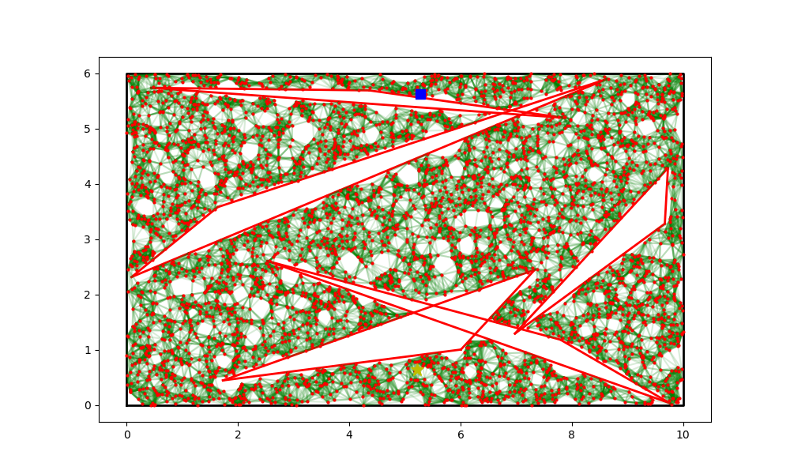
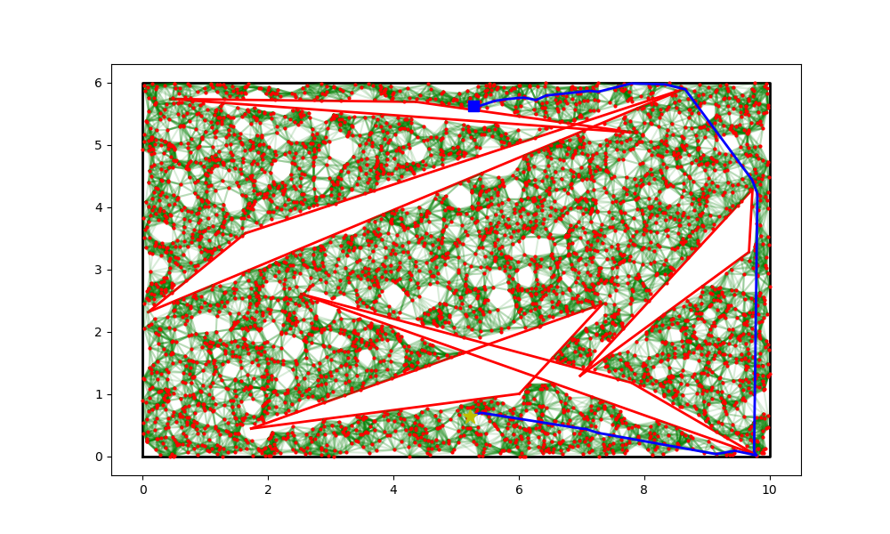
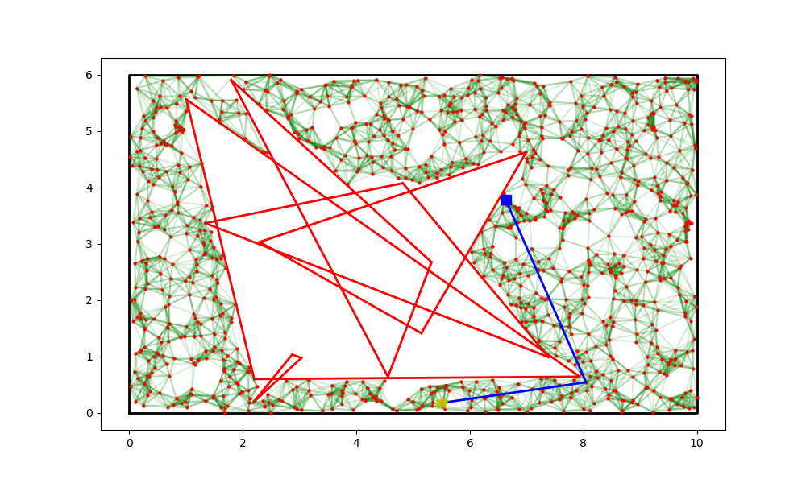
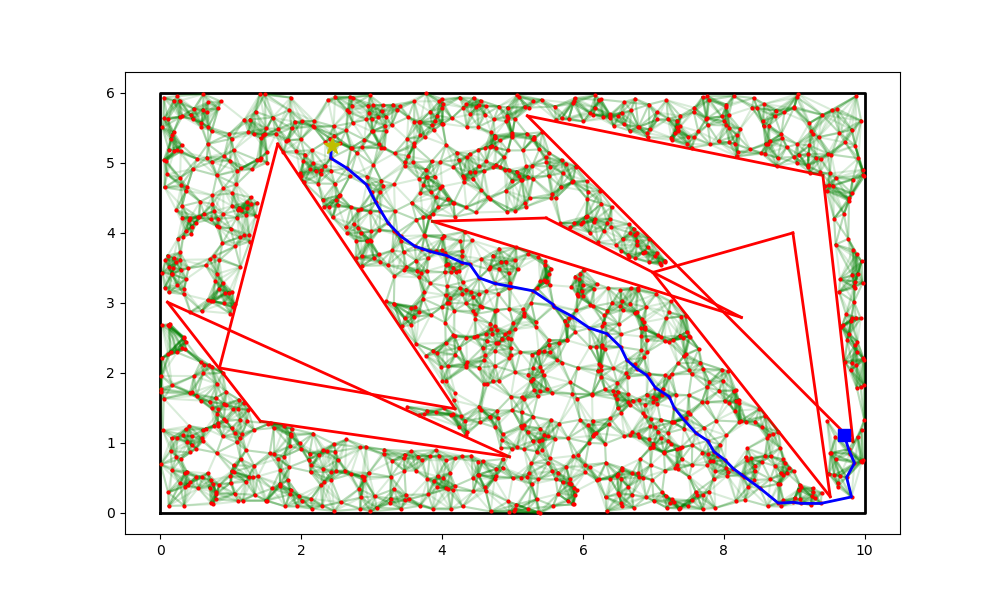
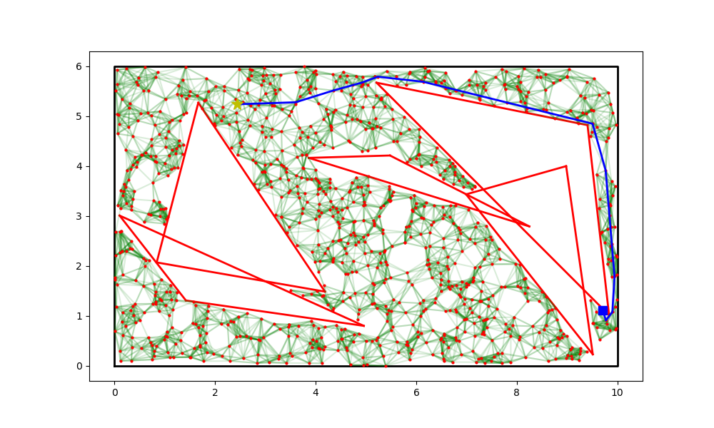
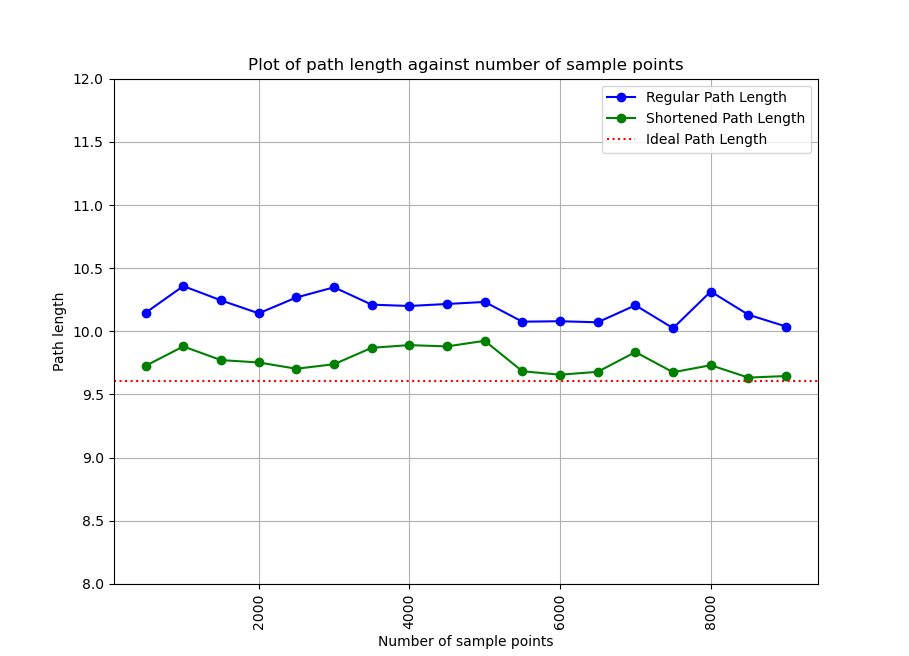

# Probabilistic Roadmap

Originally cloned from [osr_course_pkgs](https://github.com/crigroup/osr_course_pkgs)

# Contents

1. [Methodology](#methodology)
2. [Data Structures Used](#data-structures-used)
3. [Execution](#execution)
    - [Instructions](#instructions)
    - [Testing](#testing)
    - [Results](#results)
        - [Environment From Example (random seed 4, 5 obstacles)](#environment-from-example-random-seed-4-5-obstacles)
        - [Random Seed 65](#random-seed-65)
        - [Random Seed 9](#random-seed-9)

4. [Findings](#findings)
    - [General Performance](#general-performance)
    - [Downfalls of Regular PRM Approach](#downfalls-of-regular-prm-approach)
    - [Path Shortcutting](#path-shortcutting)

## Methodology
The Probabilistic Roadmap (PRM) is one of the possible methods of path planning in an environment with irregular obstacles. In summary, it takes the following steps:

1. Randomly plot nodes in the environment's free space
2. Construct a graph connecting each node with its nearby nodes using undirected edges
    - Ensure that the edges do not collide with obstacles by taking regular points along the edge and ensuring it does not fall within any obstacle
    - There are several methods for this; I have elected to choose the **k-nearest neighbors method**, where each node forms an edge with the k closest nodes to it such that it does not collide with any obstacle
3. Plot the start and goal nodes, and connect each of them to the nearest existing node
4. Conduct an appropriate graph search algorithm to find an optimal path. A path must exist if both start and goal are in the same connected component
    - I have elected to use **A\* search** as it is complete, optimal and efficient if using a good consistent heuristic

## Data Structures Used
1. I have used a **KD tree** to represent the nodes in the environment
    - It has efficient nearest neighbour search ($O(\log n)$)
    - It is balanced and hence scalable for large datasets

## Execution

### Instructions
All of the required utility functions are found in [**`prm_util/prm_2d.py`**](prm_util/prm_2d.py).
A sample scenario is layed out in [**`prm_util/prm_sample.py`**](prm_util/prm_sample.py). To execute the sample scenario, change directory to **`prm_util/`** and run [**`prm_sample.py`**](prm_util/prm_sample.py). The key functions are **`find_path`** (exercise 1) and **`do_path_shortcutting`** (exercise 2).

### Testing
Some tests for the PRM and the path shortcutting functions are available in [**`test/test_prm.py`**](test/test_prm.py). To execute the tests, change directory to **`test/`** and run [**`test_prm.py`**](test/test_prm.py).

### Results
#### Environment From Example (random seed 4, 5 obstacles)
The following diagram shows a sample roadmap plotted using PRM, 4000 sample points, start (square) and goal (star):

After conducting A* search on the above roadmap, the following path is obtained:

Upon doing further path shortcutting, the following shortened path is obtained:

Due to the shape of obstacles and the method of edge-collision detection (explained in detail under [Findings](#findings)), the number of random sampling points, the value of k in k-nearest neighbor search and the interval length for edge-collision detection must be adjusted to ensure a reasonably short and collision-free path. For the above example, 4000 points with k = 15 and path shortcutting of up to 40 reps yielded a short path length of 14.533 (an increase in shortcutting reps will decrease the path length further). A reduction in any of these metrics led to slightly longer paths, completely different general path directions or collisions with thin obstacles.

The following few sections will show the roadmaps and final shortened paths in environments based on a few other random seeds.

#### Random Seed 65
The below figure shows an environment with random seed = 65, 5 obstacles, 1000 data points, and before/after up to 40 reps of shortcutting:

A path length of about 6.185 was obtained in the end, which is very close to ideal as the obtained path goes straight to just beside the largest triangle, then straight to the goal.

#### Random Seed 9
The below figure shows an environment with random seed = 9, 5 obstacles, 1500 data points, and before/after up to 40 reps of shortcutting:

This is also close to ideal as it takes a small detour to then take the most direct route to the goal, with a total path length of about 10.035. Taking more sample points will lead to a shorter path length.

However, taking fewer sample points led to a longer path towards the top of the map to be taken (with a path length of about 11.5):

Hence, the PRM is not a one-size-fits-all algorithm, some level of trial and error with the algorithm metrics is required to strike a balance between performance and compute speed.

## Findings
### General Performance
Path length should theoretically reduce as the number of random nodes sampled in the environment increases, and it should also converge as this number tends to infinity. In practice, however, this pattern is not smooth and may contain outliers. 

The ideal approach would be to try the algorithm with different number of nodes and k values and use the parameters that yield the best result.

### Downfalls of Regular PRM Approach
If using the k-nearest neighbors method, there can be large "empty spots" throughout the roadmap. These empty spots remain even if the number of sampled nodes is increased, which may lead to seemingly poorer performance (larger path length) and convergence.

Moreover, since edge collision checks are done at intervals along the edge, there is a small chance that an approved edge actually collides with a thin undetected obstacle.

### Path Shortcutting
As shown in the plots in [Results](#results), path shortcutting can greatly improve the path length/cost, especially with a sufficient number of repetitions. This can easily alleviate the above-mentioned downfall of the k-nearest neighbors method since edge cutting can "cut" through the empty spaces.

Upon running PRM and path shortcutting for an environment with one obstacle and with different number of sample nodes (code provided in [**`prm_util/prm_plot.py`**](prm_util/prm_plot.py)), the below figure shows the path costs obtained:

As shown in the figure, path shortcutting provides a significant reduction in path costs.